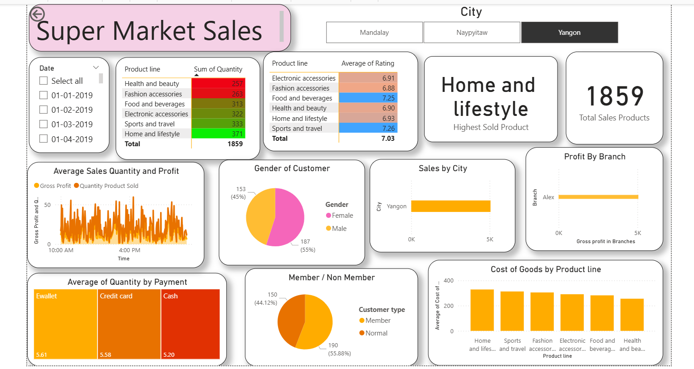

<!-- @format -->

# Supermarket Sales Analysis

A comprehensive Power BI dashboard and analysis project that visualizes and analyzes supermarket sales data across multiple branches and product categories.

## 📊 Project Overview

This project contains a Power BI dashboard and dataset for analyzing supermarket sales performance. It provides insights into sales trends, customer behavior, product performance, and branch-level metrics across three supermarket branches.

## 📁 Project Structure

```
Super Market Sales/
├── SuperMarket Analysis.csv    # Main dataset with sales transactions
├── SuperMarket Analysis.pbix   # Power BI dashboard
├── README.md                    # This file
├── image.png                    # Dashboard screenshot
└── images/                      # Additional images (if needed)
```

## 📸 Dashboard Preview



_The Power BI dashboard displays key metrics, sales trends, customer insights, and performance analytics across all branches._

## 📋 Dataset Description

The dataset contains **1,000 supermarket transaction records** with the following fields:

| Column                      | Description                                  |
| --------------------------- | -------------------------------------------- |
| **Invoice ID**              | Unique transaction identifier                |
| **Branch**                  | Store branch (Alex, Cairo, Giza)             |
| **City**                    | City location (Yangon, Mandalay, Naypyitaw)  |
| **Customer type**           | Member or Normal customer                    |
| **Gender**                  | Customer gender (Male/Female)                |
| **Product line**            | Category of products sold                    |
| **Unit price**              | Price per unit                               |
| **Quantity**                | Number of items purchased                    |
| **Tax 5%**                  | Calculated tax amount                        |
| **Sales**                   | Total sales amount                           |
| **Date**                    | Transaction date                             |
| **Time**                    | Transaction time                             |
| **Payment**                 | Payment method (Cash, Credit card, E-wallet) |
| **COGS**                    | Cost of goods sold                           |
| **Gross margin percentage** | Profit margin percentage                     |
| **Gross income**            | Gross profit amount                          |
| **Rating**                  | Customer satisfaction rating (1-10)          |

## 🏪 Key Metrics

- **Total Transactions**: 1,000+
- **Branches**: 3 (Alex, Cairo, Giza)
- **Cities**: 3 (Yangon, Mandalay, Naypyitaw)
- **Product Lines**: 6 categories
- **Payment Methods**: 3 types
- **Customer Types**: 2 segments

## 🛍️ Product Categories

- Health and beauty
- Electronic accessories
- Home and lifestyle
- Sports and travel
- Food and beverages
- Fashion accessories

## 📈 Dashboard Features

The Power BI dashboard includes:

- **Sales Overview**: Total sales, revenue trends, and performance metrics
- **Branch Analysis**: Comparative performance across branches
- **Customer Insights**: Segmentation by customer type, gender, and demographics
- **Product Performance**: Sales by product category
- **Payment Analysis**: Distribution of payment methods
- **Ratings & Satisfaction**: Customer satisfaction trends

## 🚀 Getting Started

### Prerequisites

- **Power BI Desktop** (version 2020 or later)
- **.NET Framework** (for Power BI Desktop)

### Installation

1. Clone this repository:

   ```bash
   git clone https://github.com/yourusername/supermarket-sales-analysis.git
   cd supermarket-sales-analysis
   ```

2. Open the Power BI file:
   - Navigate to the `Super Market Sales` folder
   - Double-click `SuperMarket Analysis.pbix`
   - Power BI Desktop will open with the dashboard

3. (Optional) Refresh the data:
   - In Power BI, go to **Home** → **Refresh**
   - The dashboard will reload with the latest data from the CSV file

### Using the Data

To analyze the raw data:

- Open `SuperMarket Analysis.csv` in your preferred tool (Excel, Python, R, etc.)
- Import into your data analysis software
- Create custom visualizations or analysis

## 💡 Key Insights

Some questions you can answer with this data:

- Which branch has the highest sales?
- What is the most popular product category?
- How do member vs. non-member customers differ in spending?
- What is the average customer satisfaction rating?
- Which payment method is most popular?
- How do sales vary by time of day or day of week?

## 📊 Data Preparation

The dataset has been cleaned and formatted for analysis:

- No missing values
- Consistent data types
- Pre-calculated derived fields (Tax, Sales, Gross Income)
- Ready for visualization and analysis

## 🔄 Data Updates

To update the dashboard with new data:

1. Add new records to `SuperMarket Analysis.csv`
2. Open the PBIX file in Power BI Desktop
3. Click **Home** → **Refresh** or **Transform Data** to reload
4. Publish to Power BI Service (optional)

## 📱 Supported Platforms

- **Windows**: Power BI Desktop, Power BI Service
- **Mac**: Power BI Service (browser-based)
- **Web**: Power BI Service for online sharing and collaboration

## 📄 License

This project is licensed under the **MIT License** - see the LICENSE file for details.

## 👤 Author

Created for supermarket sales analysis and business intelligence purposes.

## 🤝 Contributing

Contributions are welcome! To contribute:

1. Fork the repository
2. Create a feature branch (`git checkout -b feature/improvement`)
3. Commit your changes (`git commit -am 'Add new feature'`)
4. Push to the branch (`git push origin feature/improvement`)
5. Create a Pull Request

## 💬 Support

For issues, questions, or suggestions:

- Open an issue on GitHub
- Contact the project maintainer

## 📚 Resources

- [Power BI Documentation](https://docs.microsoft.com/power-bi/)
- [CSV File Specifications](https://tools.ietf.org/html/rfc4180)
- [Data Analysis Best Practices](https://docs.microsoft.com/en-us/power-bi/fundamentals/power-bi-service-overview)

## 🎯 Future Enhancements

- [ ] Add real-time data refresh capability
- [ ] Implement advanced forecasting models
- [ ] Add mobile dashboard view
- [ ] Create automated alerts for anomalies
- [ ] Integrate with other data sources

---

**Last Updated**: June 2026

**Version**: 1.0
